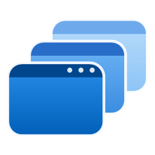

# Windows VD Helper

A tray app for Windows 11 virtual desktops: shows the current desktop in the tray, switches instantly, and lets you manage desktops and windows from the tray menu or with hotkeys.

## Install

1. Download `WindowsVDHelper-<version>.zip` from [Releases](https://github.com/benju66/WindowsVDHelper/releases) and unzip it.
2. Double-click **Install.cmd** (no admin rights needed).

It installs to `%LOCALAPPDATA%\Programs\WindowsVDHelper`, adds **Windows VD Helper** to the Start menu, starts with Windows, and starts the app. Run Install.cmd again to update; **Uninstall.cmd** removes it (your settings are kept).

From the source code, double-click **Install.cmd** in the repository root instead: it builds the app first (needs the [.NET SDK](https://dotnet.microsoft.com/download)) and can also install the Command Palette extension.

The desktop and window features (moving, pinning, the panel's window actions, the Command Palette extension) need Windows 11 24H2 or later.

## Build

Close the app first (the running exe is locked), then:

```
powershell -ExecutionPolicy Bypass -File Scripts\build-local.ps1
```

This builds `dist\WindowsVirtualDesktopHelper.exe` with just the .NET SDK (no Visual Studio needed).

## Features

- Desktop number (and optionally the name initial) in the tray, with a tooltip like "Work - desktop 2 of 4"
- Instant updates via Windows' own desktop change notifications (Windows 11 24H2/25H2)
- Tray menu (right-click the number):
  - all desktops, click to switch
  - new / rename / close desktop
  - move the last used window to another desktop, or show it on all desktops
  - **Pin windows to all desktops**: a checklist of every open window; click to pin/unpin, the menu stays open
  - options: wrap around, color per desktop, switch along when moving a window, open config/log
- Hotkeys (defaults, change them in the config):
  - `Ctrl + Shift + Win + Right/Left` move the active window to the next/previous desktop
  - `Ctrl + Shift + Win + P` pin/unpin the active window on all desktops
  - `Alt + 1..9` jump to a desktop, `Alt + ~` back to the previous desktop (off by default, enable in the config)
- Optional switch overlay and permanent status overlay
- A notification when a hotkey can't be registered because another app uses it

## Command Palette extension

`CommandPalette\` contains a PowerToys Command Palette extension (needs the app running and Windows Developer Mode):

```
powershell -ExecutionPolicy Bypass -File CommandPalette\build.ps1
```

Then run **Reload** in Command Palette. Commands: *Virtual desktops* (switch, rename, close, new), *Find window on any desktop* (Enter jumps to it; more actions: move, pin, pin app, always show, bring app windows here), *Pin windows to all desktops* (checklist), *Move window to desktop*, *Move window to a new desktop*, *Show window on all desktops*, *New desktop*, and *Switch to &lt;desktop name&gt;* for every desktop.

## Control from other tools

The running app accepts commands (from scripts, AutoHotkey, a Stream Deck, ...):

```
WindowsVirtualDesktopHelper.exe --switch 2
WindowsVirtualDesktopHelper.exe --action MoveWindowForward
WindowsVirtualDesktopHelper.exe --send "{\"cmd\":\"new\"}"
```

Actions: `DesktopForward`, `DesktopBackward`, `PreviousDesktop`, `Desktop1`..`Desktop9`, `MoveWindowForward`, `MoveWindowBackward`, `MoveWindowToDesktop1`..`9`, `MoveWindowToNewDesktop`, `TogglePinWindow`, `TogglePinApp`, `GatherAppWindows`, `NewDesktop`. The protocol (a per-user named pipe, one JSON line per request) is documented in `Source\App\ControlServer.cs`.

## Config

`%APPDATA%\WindowsVirtualDesktopHelper\WindowsVirtualDesktopHelper.exe.config` (tray menu: Options > Open config folder). Changes apply immediately. All options: tray menu > About > Show Config, or [Documentation/Settings.md](Documentation/Settings.md), [Hotkeys](Documentation/Hotkeys.md), [Actions](Documentation/Actions.md).

The log is written to `WindowsVirtualDesktopHelper.log` in the same folder.

## License

Based on Windows Virtual Desktop Helper, licensed under the GNU GPL v3 (see [LICENSE.md](LICENSE.md)). The virtual desktop API code is MIT licensed (see [Source/VirtualDesktopAPI/LICENSE.md](Source/VirtualDesktopAPI/LICENSE.md)).
